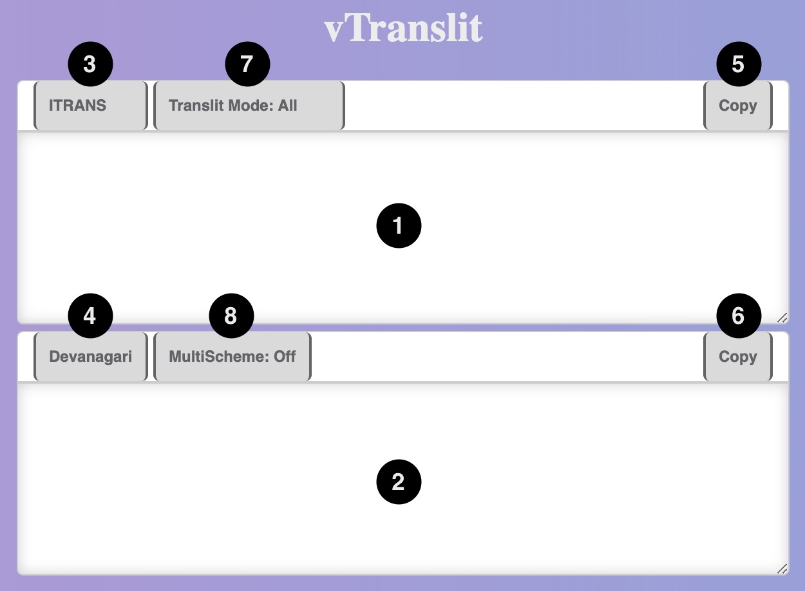

# Usage

vTranslit is a tool that helps to transliterate from ITRANS to many indic scripts (see 'About' tab for currently supported scripts). It also supports transliteration from the indic scripts to ITRANS.

Scripts such as Devanagari, Kannada, etc. and schemes such as ITRANS, IAST, etc. are referred to as **schemes** in vTranslit since they all are ordered arrangement of characters.

## The Basics



1. Input: Type or paste here the text to be transliterated.
2. Output: The transliterated output will appear here as you type.
3. From-scheme: Select the scheme from which input text is to be transliterated.
4. To-Scheme: Select the scheme to which input text is to be transliterated.
5. Copy Input: Click to copy the input text.
6. Copy Output: Click to copy the output text.
7. TranslitMode: Select the transliteration mode. (Discussed in a seperate section below)
8. MultiScheme: Turn on or off transliteration of input to multiple schemes. (Discussed in a seperate section below)

## TranslitMode

TranslitMode helps to control the transliteration process. Text inside the markers '#{' and '}#' will be transliterated or not transliterated based on the selected TranslitMode. There are three modes of transliteration (TranslitMode):

1. All: Everything is transliterated.  
   Eg: raama raama raama => राम राम राम  
   Eg: raama #{raama}# raama => राम #{राम}# राम
2. Except: Everything **except** the text inside the markers are transliterated.  
   Eg: raama #{raama}# raama => राम #{raama}# राम
3. Only: **Only** the text inside the markers is transliterated. Text outside the markers are not transliterated.  
   Eg: raama #{raama}# raama => raama #{राम}# raama

## MultiTranslit

MultiTranslit is useful when you need to write in more than one scheme. Instead of switching between different schemes, you can mention the scheme using '@' followed by the scheme-code and start writing in ITRANS. And when you want to switch to another scheme you can mention that scheme as you did before (`@<scheme-code>`) and continue writing.

Scheme-codes for available schemes can be found in the 'About' tab.

### Syntax

```
#{@<scheme-code> <input-text>}#
```

#### Steps:

1. Start by typing the opening marker `#{`.
2. Mention the scheme you want the output in, using symbol '@' followed by the scheme-code of the scheme.
3. Leave a space and start writing the text to be transliterated. (This space will be ignored in the output).
4. Close the input text with the closing marker.

### Examples

- #{@Deva raama raama raama}# => राम राम राम #{@Deva raama raama raama}#
- #{@Taml raama raama raama}# => राम राम राम ராம ராம ராம
- #{@Deva raama raama raama}# raama raama raama #{@Taml raama raama raama}# => राम राम राम ராம ராம ராம
- #{@Deva raama raama raama @Taml raama raama raama}# => राम राम राम ராம ராம ராம

### Points to Note

In MultiTranslit

- 'from-scheme', 'to-scheme' and 'TranslitMode' would be disabled.
- input should be in 'ITRANS' scheme only.
- text outside the markers are not transliterated.
- text inside the markers are transliterated only if scheme-code is specified.
